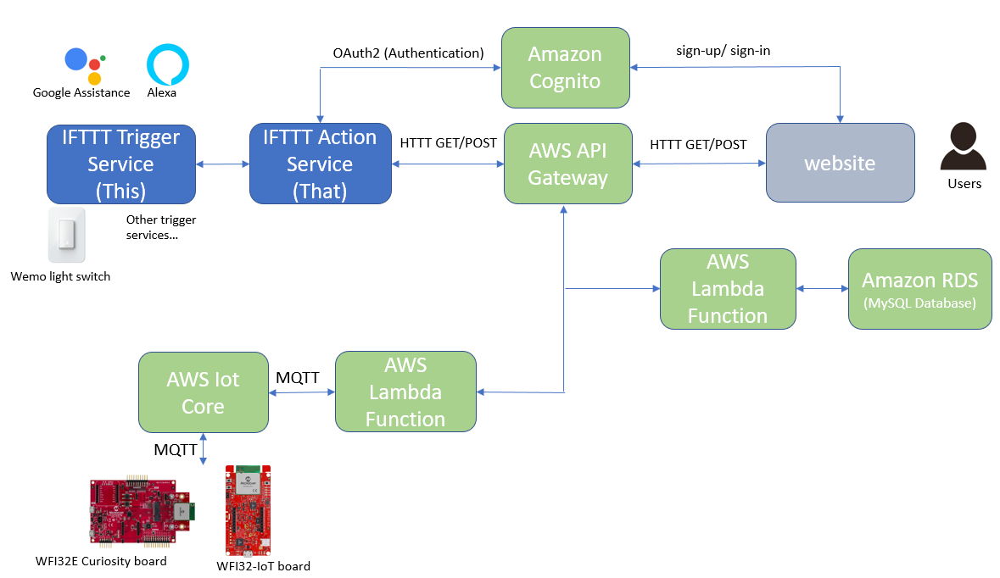
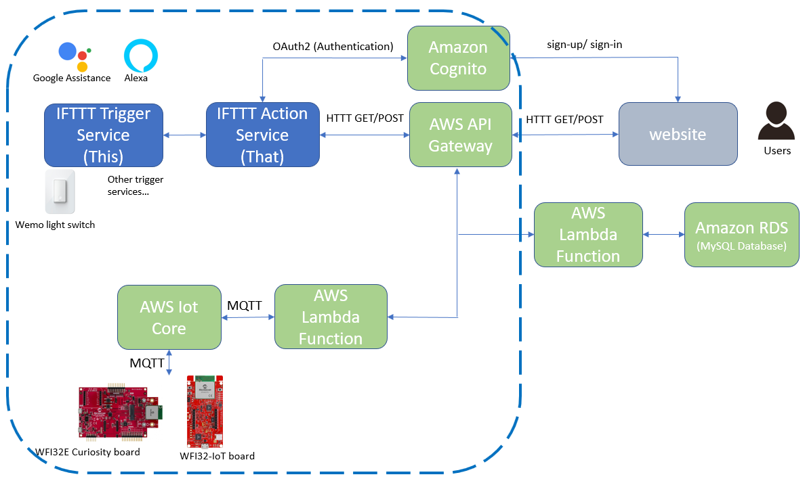
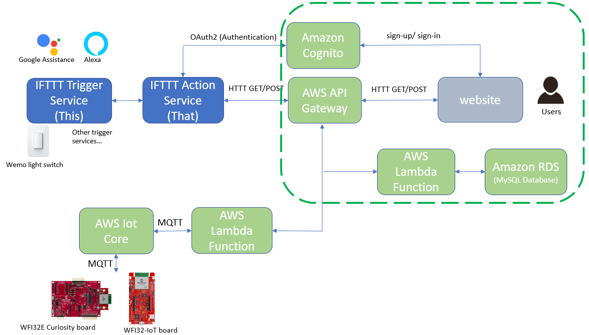
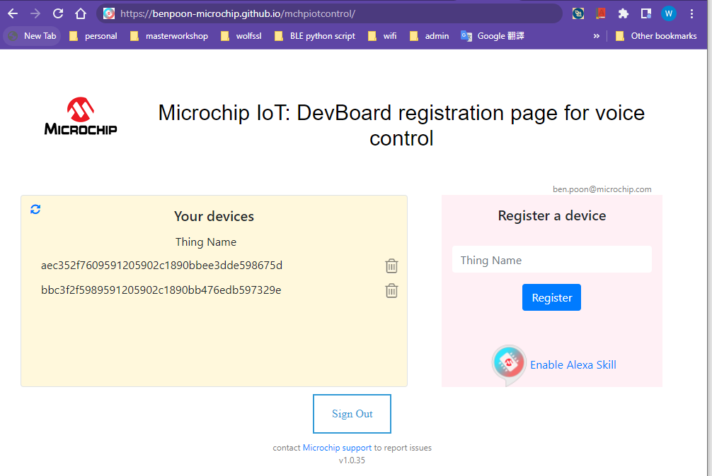
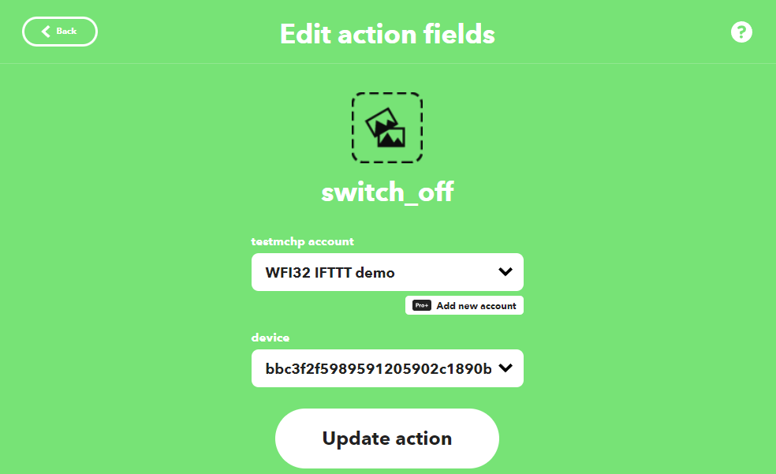

# OverView

[Back to Main page](../README.md#contents)  

## Contents

1. [Overview Of The Solution](#chapter1.1)
    1. [IFTTT Service Workflow](#chapter1.1.1)
    1. [Device Registration System](#chapter1.1.2)

## Overview Of The Solution

This solution is close to a market end product. It includes a user registation system to let user sign-up/ sign-in the account and register the end devices (WFI32) to their account. When user create the IFTTT Applet, they can select the end devices in their account for the action. The user registation system use the Amazon Cognito to provide the user account pool, the Amazon Cogntio can also provide the the user identity for the IFTTT Service authenization. This increase the security to make the solution like the end product solution.

Overall block diagram
    

    
    

The solution can separte into two parts:
- IFTTT Service Workflow
- Device Registration System

### IFTTT Service Workflow

The blue circle below is the IFTTT Service Workflow:
    

    
    

Highlights:
- The IFTTT trigger service is a third party published service. Example of IFTTT trigger services are Alexa, Google Assistance, Wemo light switch etc. With these example services, users can speak to Alexa/ Google Assistance enabled device, or use Wemo light switch to control the endpoint devices (WFI32-IoT board/ WFI32E Curiosity board)
- The IFTTT action service is created in this project to work with the AWS Cloud and the endpoint devices (WFI32-IoT board/ WFI32E Curiosity board)
- IFTTT action service authenticate with the Amazon Cogntio using OAuth2 protocol. Secure token is get to access the HTTP API if the authentication is success 
- Amazon API Gateway provide the HTTP API for the IFTTT service to work with. IFTTT service send HTTP GET/ POST to retieve or send event to the endpoint devices. The requirpments for the IFTTT Service API can be found in this [link](https://ifttt.com/docs/api_reference) 
- AWS Lambda functions are needed to process the HTTP request from IFTTT action service. The Lambda publish MQTT message to AWS IoT Core. Endpoint devices (WFI32-IoT board/ WFI32E Curiosity board) connected to AWS IoT Core and able to receive the MQTT message from the Lambda.
- Two action (switch_on and switch_off) is created in the action service, the LED on endpoint devices (WFI32-IoT board/ WFI32E Curiosity board) can be turn on/ off

### Device Registration System

The green circle below is the device registartion system design:
    

    
    

Highlights:
- Amazon Cognito provide the user pool feature. Users sign-up/ sign-in in the website, user account is created for device registration
- In the website, users can register the things name of the WFI32-IoT board/ PIC32MZW1 Curiosity board to their account
- Amazon API Gateway provide the HTTP API for the website to register/ delete the device and get the registered device info  
- AWS Lambda functions are needed to process the HTTP request from the website 
- Account user name and device things name are stored in MySQL database of Amazon RDS

In the Registration website, thing name can be registered/ deleted from the account
    

    
    

With the device registation system, you can select the device in the dropdown menu when you enable the IFTTT action
    

    
    

[Back to Main page](../README.md#contents)  
