# 3. Device Registration System Setup

[Back to Main page](../README.md)

## Contents

1. [Create Cognito User Pool And Identity Pool](#chapter3.1)
1. [Create RDS For Storing Registration Data](#chapter3.2)
1. [Create Lambda Function for Device Registration](#chapter3.3)
    1.  [Create policy for lambda to access VPC](#chapter3.3.1)
    1.  [Lambda Function for registering devices](#chapter3.3.2)
    1.  [Lambda Function for getting user devices](#chapter3.3.3)
    1.  [Lambda Function for deleting user devices](#chapter3.3.4)
1. [Create API Gateway](#chapter3.4)
1. [Create Registration website](#chapter3.5)

## 3.1 Create Cognito User Pool And Identity Pool<a name="chapter3.1"></a>

Amazon Cognito is used to provide user identity for the end users, including sign-up, sign-in features. With Amazon Cognito, users can sign-up and sign-in the account using a website that mentioned in this document.

To do this, you can follow below steps:
1.	Go to Congito Console
2.	Click **Manage User Pools** to open **Your User Pools** browser.
3.	Click **Create a user pool**.
4.	Enter a pool name and select Review defaults.
5.	Click **Create pool** to create the user pool.
6.	Select **App clients** in the left panel and click **Add an app client** to create App Client “**webapp**" in the user pool just created.
7.	Tick the **Generate client secret** check box.
8.	Click **Create app client**.
    <p align="center">
    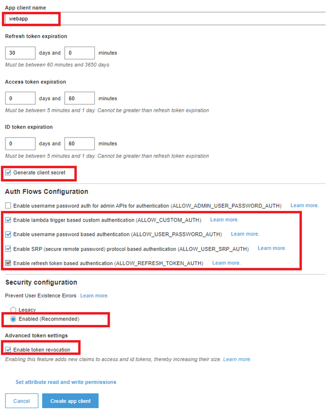
    </p>
9.	Select **App clients settings**.
10.	In App Client setting of "**webapp**", tick the "**Cognito User Pool**" check box.
11.	Additionally tick the "Authorization code grant", “Implicit grant”, "email", "openid", and "profile" check boxes.
12.	Enter your website URL to  “Callback URL” and  “Sign out URL”. You will set up your website and get the URL in the Section [Create Registration Website](#step6)
13.	Click **Save changes**
    <p align="center">
    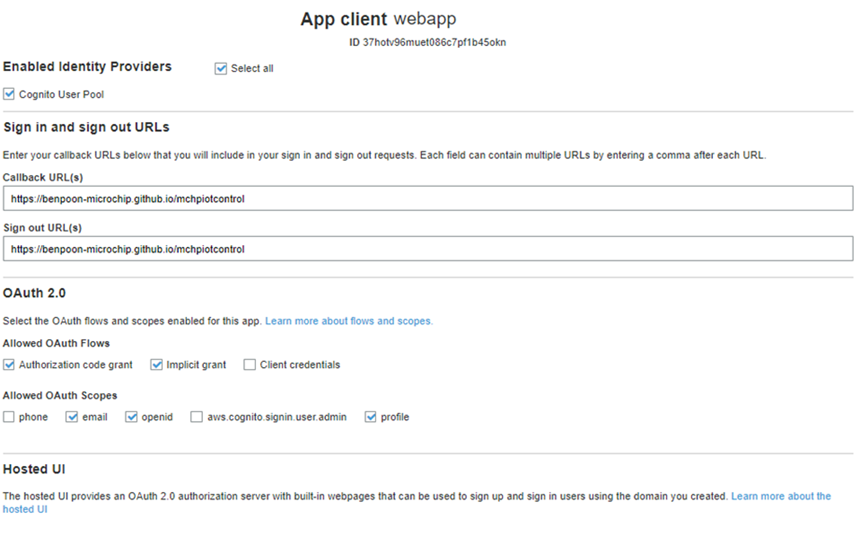
    </p>
14.	Select “Domain Name”, type the domain name. Click **Save Changes**. Change the domain name if the domain name is already used by another.
    <p align="center">
    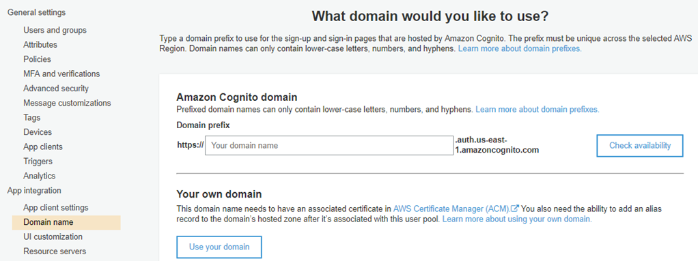
    </p>

15.	Go to Congito Console
16.	Click **Manage Identity Pools**.
17.	Click **Create new identity pool**.
18.	Input an Identity pool name
19.	In "Authentication providers" of the Identity pool setting, select “Cognito”. Type the “user pool ID” and the “App client ID” of "webapp" (The user pool ID and App client ID is found in the user pool setting page).
    <p align="center">
    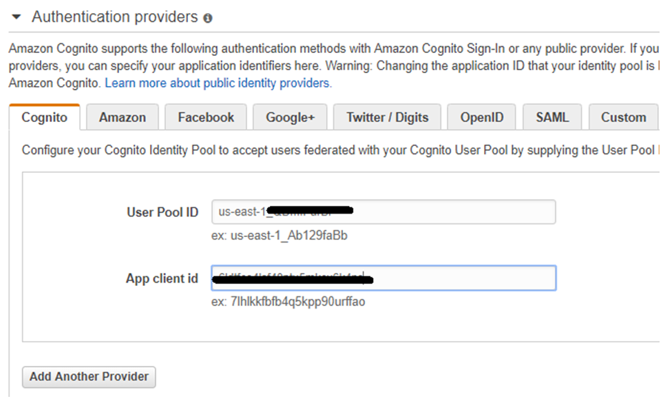
    </p>
20.	Click **Create Pool**. While creating the identity pool, Cognito helps setup two roles in Identity and Access Management (IAM). The example format for the names are: Cognito_<Identity_Pool_Name>Auth_Role and Cognito_< Identity_Pool_Name >Unauth_Role.

    Click **View Details** to see details on the console.

21.	Click **Allow** to create the roles.

---

## 3.2 Create RDS For Storing Registration Data<a name="chapter3.2"></a>

The MySQL database in Amazon RDS Service is used to store the registration data. These registration data include the account user name, thing name and device friendly name. To do this, you can follow below steps:

1.	Go to RDS Console
2.	Click **Create database**
3.	Select **Standard create** and **MySQL** as the engine type.
    <p align="center">
    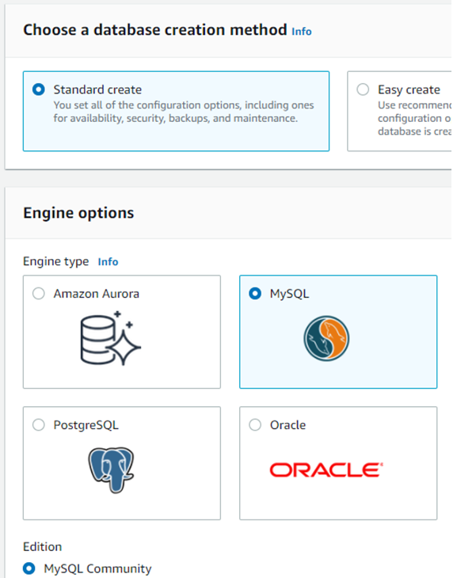
    </p>
4.	Select **Free tier**  in **Templates**
    <p align="center">
    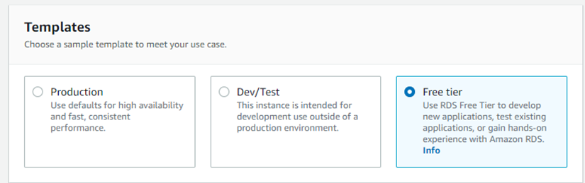
    </p>
5.	Input Master password and Confirmed password in Credentials Settings. Copy and paste the user name and password to notepad for later configuration.
    <p align="center">
    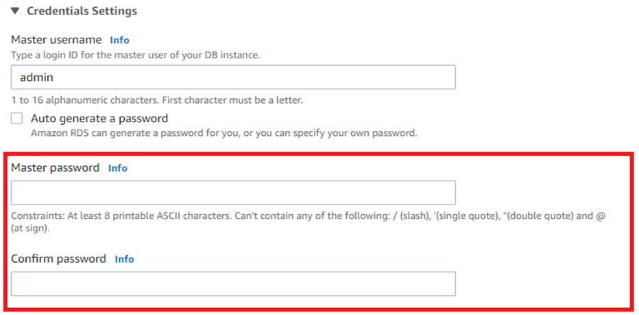
    </p>
6.	Type a database name in **Additional configuration**. Copy and paste the database name to notepad for later configuration.
    <p align="center">
    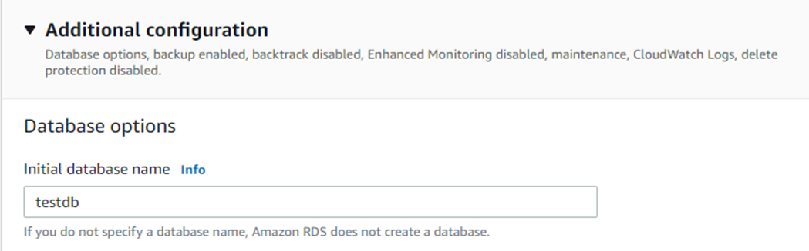
    </p>
7.	Leave other settings to default
8.	Click **Create database** button

---
## 3.3 Create Lambda Function for Device Registration <a name="chapter3.3"></a>

There are 3 Lambda functions are used for device registration to the user’s Cognito account.
Before creating the lambda, we need to create the policy for lambda role to access VPC.

### 3.3.1 Create policy for lambda to access VPC <a name="chapter3.3.1"></a>
1.	Go to AWS account IAM console (https://aws.amazon.com/iam/)
2.	Select **Policy** in the left panel, click **Create Policy** button
3.  Select **JSON** tab and paste below content to the policy 
    ```
    {
        "Version": "2012-10-17",
        "Statement": [
            {
                "Sid": "VisualEditor0",
                "Effect": "Allow",
                "Action": [
                    "ec2:CreateNetworkInterface",
                    "ec2:DescribeInstances",
                    "ec2:DescribeNetworkInterfaces",
                    "ec2:DeleteNetworkInterface",
                    "ec2:AttachNetworkInterface"
                ],
                "Resource": "*"
            }
        ]
    }
    ```

4.  Click **Next: Tags** and **Next: Review**
5.  Input the policy name "lambda_access_vpc_policy", click **Create policy**


### 3.3.2 Lambda Function for registering devices <a name="chapter3.3.2"></a>
1.	Go to AWS account Lambda console (https://aws.amazon.com/lambda/)
2.	Click Create Function Button
3.	Select below settings:
    <p align="center">
    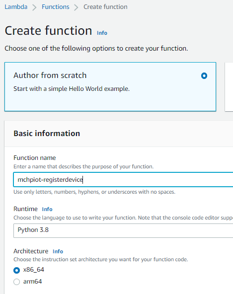
    </p>
4.	Click Create Function Button in the bottom
5.	Go to Tab Configuration, select Environment Variable

    Set variable **USER_POOL_ID**, **USER_POOL_APP_CLIENT_ID**, **USER_POOL_RGION**, **DB_INSTANCE**, **DB_NAME**, **DB_USER_NAME** and **DB_PASSWORD** 
    <p align="center">
    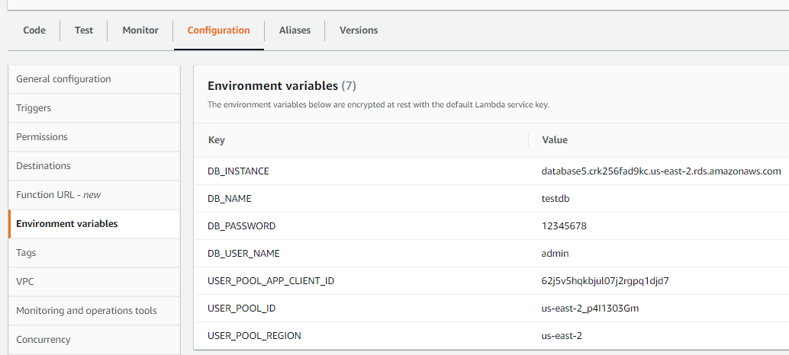
    </p>

    **USER_POOL_ID** is the Cognito User Pool ID. You created User Pool in [Chapter 3.1 Create Congito User Pool And Identity Pool](#chapter3.1)  
    **USER_POOL_APP_CLIENT_ID** is the ID of the Cognito User Pool APP Client “webapp’. You create this APP client in [Chapter 3.1 Create Congito User Pool And Identity Pool](#chapter3.1) 
    **USER_POOL_Region** is the Cognito User Pool region.  
    **DB_INSTANCE** is the RDS database instance name; **DB_NAME** is the RDS database name;  **DB_USER_NAME** and **DB_ PASSWORD** are the user name and password of the  RDS database. you set these values when you create the database at [Chapter 3.2 Create RDS For Storing Registration Data](#chapter3.2) 

6.  Go to Tab Configuration, select **Permission**, click the execution role name
    <p align="center">
    
    </p>
7.  Add "lambda_access_vpc_policy" Policy to the role
    <p align="center">
    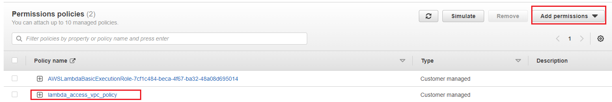
    </p>

8.	Go to Tab Configuration, select VPC, edit the VPC be the default VPC, Subnets be the region b subnet (private subnet we defined in section Create NAT Gateway And Route table), and Security groups be the default one.
    <p align="center">
    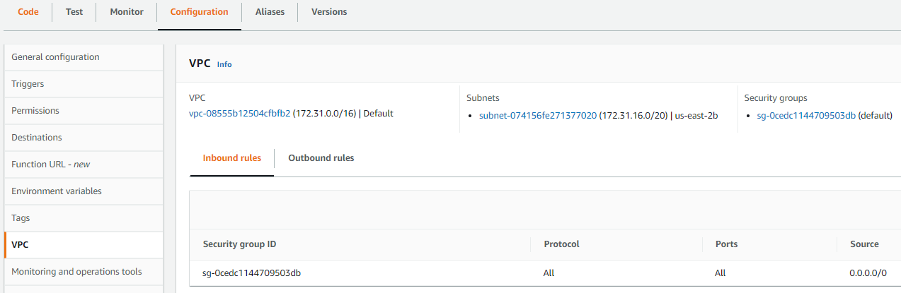
    </p>

9.	Go to Tab Code, click Upload from  select .zip file, upload file `mchpiot-registerdevice.zip` loacated in `\03_device_registration_system_setup\resources\software`

10. Modify the **keys** variable defined in the function **validateToken()** in lambda_function.py  
    The keys is JSON Web Key Set (JWKS) of your Congito user pool which is used to decode the JWT token from the user pool. You can get your JWKS at  
    > "https://cognito-idp.{region}.amazonaws.com/{cognito_userPoolId}/.well-known/jwks.json"  
    
    **Example**: https://cognito-idp.us-east-2.amazonaws.com/us-east-2_p4I1303Gm/.well-known/jwks.json


10.	Click Deploy button in the Code source page

### 3.3.3 Lambda Function for getting user devices <a name="chapter3.3.3"></a>
1.	Go to AWS account Lambda console (https://aws.amazon.com/lambda/)
2.	Click Create Function Button
3.	Select below settings:
    <p align="center">
    
    </p>
4.	Click Create Function Button in the bottom
5.	Go to Tab Configuration, select Environment Variable

    Set variable **USER_POOL_ID**, **USER_POOL_APP_CLIENT_ID**, **USER_POOL_RGION**, **DB_INSTANCE**, **DB_NAME**, **DB_USER_NAME** and **DB_PASSWORD** 
    <p align="center">
    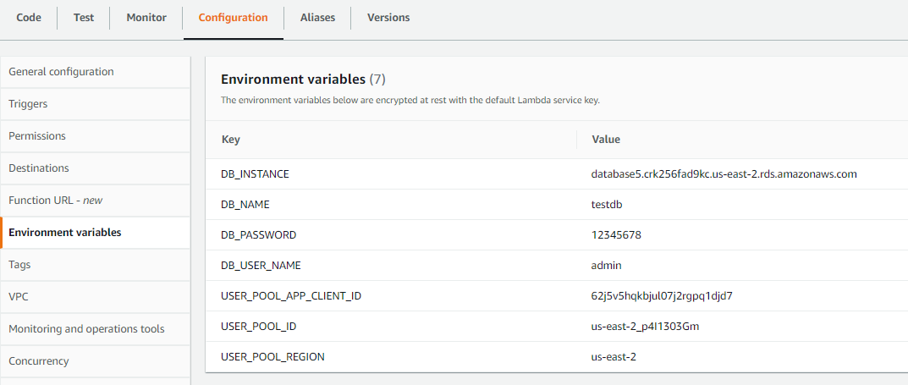
    </p>

    **USER_POOL_ID** is the Cognito User Pool ID. You created User Pool in [Chapter 3.1 Create Congito User Pool And Identity Pool](#chapter3.1)  
    **USER_POOL_APP_CLIENT_ID** is the ID of the Cognito User Pool APP Client “webapp’. You create this APP client in [Chapter 3.1 Create Congito User Pool And Identity Pool](#chapter3.1) 
    **USER_POOL_Region** is the Cognito User Pool region.  
    **DB_INSTANCE** is the RDS database instance name; **DB_NAME** is the RDS database name;  **DB_USER_NAME** and **DB_ PASSWORD** are the user name and password of the  RDS database. You set these values when you create the database at [Chapter 3.2 Create RDS For Storing Registration Data](#chapter3.2) 

6.  Go to Tab Configuration, select **Permission**, click the execution role name
    <p align="center">
    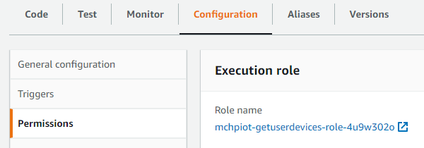
    </p>
7.  Add "lambda_access_vpc_policy" Policy to the role
    <p align="center">
    
    </p>

8.	Go to Tab Configuration, select VPC, edit the VPC be the default VPC, Subnets be the region b subnet (private subnet we defined in section Create NAT Gateway And Route table), and Security groups be the default one.
    <p align="center">
    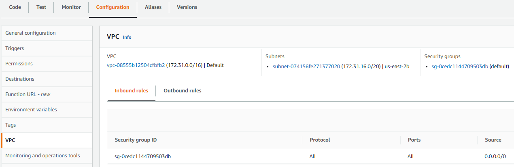
    </p>

9.	Go to Tab Code, click Upload from  select .zip file, upload file `mchpiot-getuserdevices.zip` loacated in `\03_device_registration_system_setup\resources\software`

10. Modify the **keys** variable defined in the function **validateToken()** in lambda_function.py  
    The keys is JSON Web Key Set (JWKS) of your Congito user pool which is used to decode the JWT token from the user pool. You can get your JWKS at  
    > "https://cognito-idp.{region}.amazonaws.com/{cognito_userPoolId}/.well-known/jwks.json"  
    
    **Example**: https://cognito-idp.us-east-2.amazonaws.com/us-east-2_p4I1303Gm/.well-known/jwks.json

11.	Click Deploy button in the Code source page

### 3.3.4 Lambda Function for deleting user devices <a name="chapter3.3.4"></a>
1.	Go to AWS account Lambda console (https://aws.amazon.com/lambda/)
2.	Click Create Function Button
3.	Select below settings:
    <p align="center">
    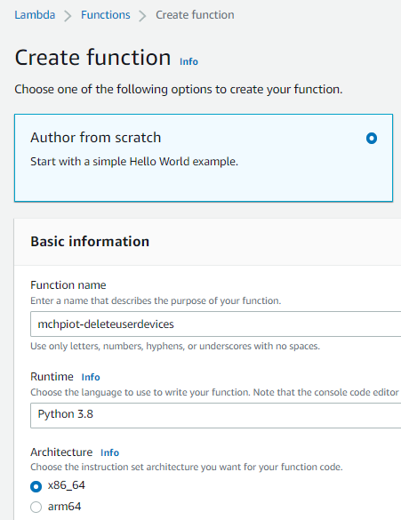
    </p>
4.	Click Create Function Button in the bottom
5.	Go to Tab Configuration, select Environment Variable
    
    Set variable **USER_POOL_ID**, **USER_POOL_APP_CLIENT_ID**, **USER_POOL_RGION**, **DB_INSTANCE**, **DB_NAME**, **DB_USER_NAME** and **DB_PASSWORD** 
    <p align="center">
    
    </p>

    **USER_POOL_ID** is the Cognito User Pool ID. You created User Pool in [Chapter 3.1 Create Congito User Pool And Identity Pool](#chapter3.1)  
    **USER_POOL_APP_CLIENT_ID** is the ID of the Cognito User Pool APP Client “webapp’. You create this APP client in [Chapter 3.1 Create Congito User Pool And Identity Pool](#chapter3.1)   
    **USER_POOL_Region** is the Cognito User Pool region.  
    **DB_INSTANCE** is the RDS database instance name; **DB_NAME** is the RDS database name;  **DB_USER_NAME** and **DB_ PASSWORD** are the user name and password of the  RDS database. You set these values when you create the database at [Chapter 3.2 Create RDS For Storing Registration Data](#chapter3.2) 

6.  Go to Tab Configuration, select **Permission**, click the execution role name
    <p align="center">
    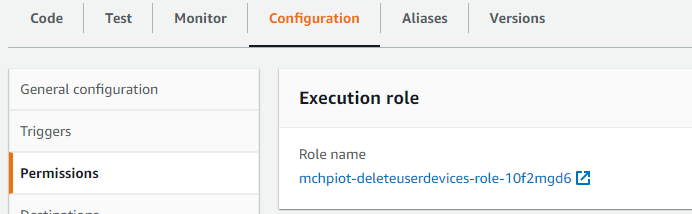
    </p>
7.  Add "lambda_access_vpc_policy" Policy to the role
    <p align="center">
    
    </p>

8.	Go to Tab Configuration, select VPC, edit the VPC be the default VPC, Subnets be the region b subnet (private subnet we defined in section Create NAT Gateway And Route table), and Security groups be the default one.
    <p align="center">
    
    </p>

9.	Go to Tab Code, click Upload from  select .zip file, upload file `mchpiot-deleteuserdevces.zip` loacated in `\03_device_registration_system_setup\resources\software`

10. Modify the **keys** variable defined in the function **validateToken()** in lambda_function.py  
    The keys is JSON Web Key Set (JWKS) of your Congito user pool which is used to decode the JWT token from the user pool. You can get your JWKS at  
    > "https://cognito-idp.{region}.amazonaws.com/{cognito_userPoolId}/.well-known/jwks.json"  
    
    **Example**: https://cognito-idp.us-east-2.amazonaws.com/us-east-2_p4I1303Gm/.well-known/jwks.json

11.	Click Deploy button in the Code source page

---
## 3.4 Create API Gateway <a name="chapter3.4"></a>

There is a web page for user to register the device. This webpage uses HTTP API to work with the cloud to manage the device registration. You need to use Amazon API Gateway Service to create HTTP API and work with the Lambda functions for device registration.  

Below table show the routes of the API you need to create.

| **Method** | **Resource Path**         | **Integrations**                                | **Usage**                      |
|------------|---------------------------|-------------------------------------------------|--------------------------------|
| GET        | mchpiot-deleteuserdevices | Lambda function: MCHPIOT-Test-deleteuserdevices | Deregister the device          |
| GET        | mchpiot-getuserdevices    | Lambda function: MCHPIOT-Test-getuserdevices    | Get the registered device list |
| POST       | mchpiot-registerdevice    | Lambda function: MCHPIOT-Test-registerdevice    | Register the device            |


Steps:
1.	Go to  Amazon API Gateway console
2.	In the navigation pane, choose APIs.
3.	Click Create API
4.	Choose HTTP API, click Build
5.	Set a name for the API
6.	Click Add integration to add the integrations. The integrations are the backend services that the API will communicate with. According to the above table, we have 4 integrations needed to be added. All these integrations are Lambda function. Below picture show the added integrations. 
    <p align="center">
    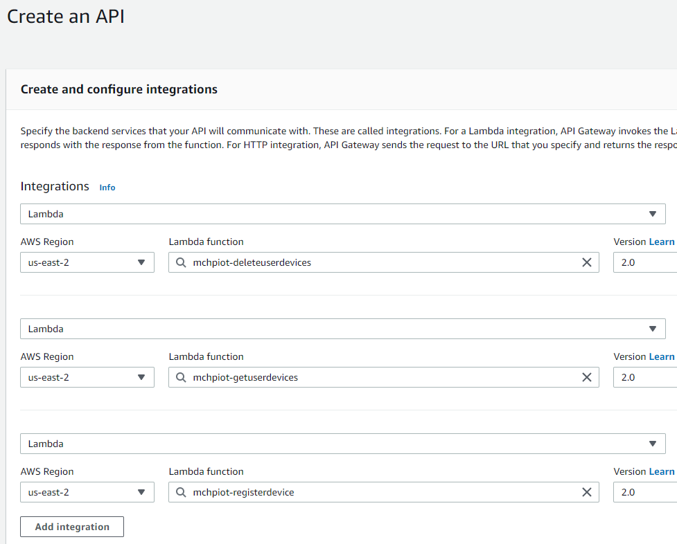
    </p>
7.	Click Next
8.	Configure the routes as below picture, click Next
    <p align="center">
    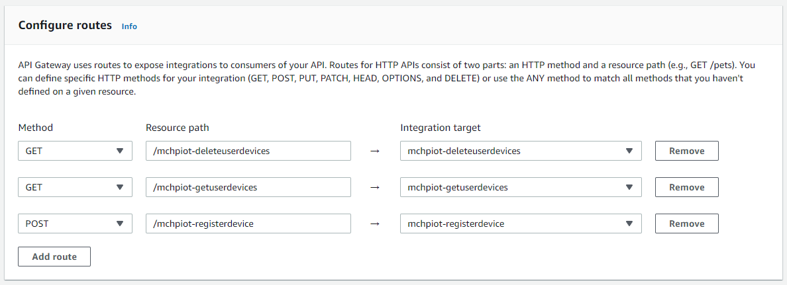
    </p>
9.	Keep the Stage name as $default, click Next
10.	Click Create
11.	After you create, they API, you can find the Invoke URL of this API in the details of the API. Copy this URL as this URL is needed in the webpage and in some of the Lambda functions.
    <p align="center">
    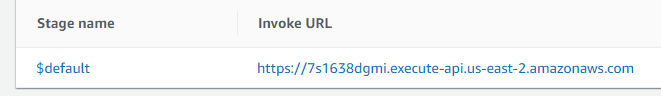
    </p>

---
## 3.5 Create Registration website <a name="chapter3.5"></a>

You can use Github to host the registration website.
Setup steps:
1.	Create and login to your Github account 
2.	Create a repository named “mchpiotcontrol” for the website code.
3.	Unzip the website_code.zip to get the content of the website, do below change in the index.html
    - Search and replace all “https://xxxxxxx.execute-api.us-east-2.amazonaws.com" with the API Gateway URL. You can get the url in [Chapter 3.4 Create API Gateway, step 11](#chapter3.4) 
    - Input below items for Cognito configuration
    <p align="center">
    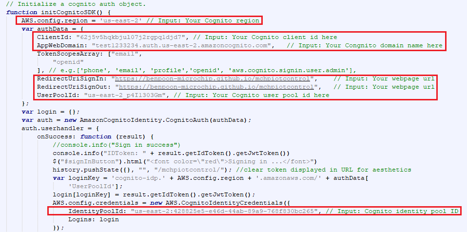
    </p>

4.	Upload all the website code in this repository

5.	Go to the Settings of the repository, set the Source of the GiHub Pages like below picture
    <p align="center">
    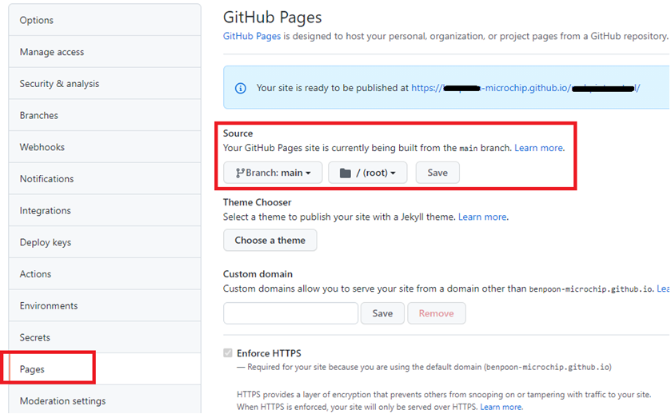
    </p>
6.	User can access the website at https//<GITHUB_ID>.github.io/mchpiotcontrol