# 4. IFTTT Service setup

[Back to Main page](../README.md)

## Contents

1.  [Create Cognito User Pool Client](#chapter4.1)
1.  [Create Lambda Function for IFTTT Service ](#chapter4.2)
    1.  [Lambda Function to provide user info for the IFTTT Service](#chapter4.2.1)
    1.  [Lambda Function to provide service status for the IFTTT Service](#chapter4.2.2)
    1.  [Lambda Function for action (switch on)](#chapter4.2.3)
    1.  [Lambda Function for action (switch off)](#chapter4.2.4)
    1.  [Lambda Function for action device option](#chapter4.2.5)
1.  [Create API Gateway](#chapter4.3)
1.  [IFTTT Service Configuration](#chapter4.4)
---
## 4.1 Create Cognito User Pool Client 

You need to create a Cognito User Pool Client for the authenientication with the IFTTT Service

To do this, you can follow below steps:
1.	Go to Congito Console
2.	Select the Cognito Pool that you created in [Chapter 3.1 Create Cognito User Pool And Identity Pool](../03_device_registration_system_setup/README.md#chapter3.1)
6.	Select **App clients** in the left panel and click **Add an app client** to create App Client “**iftttapp**"
7.	Tick the **Generate client secret** check box.
8.	Click **Create app client**.
    

    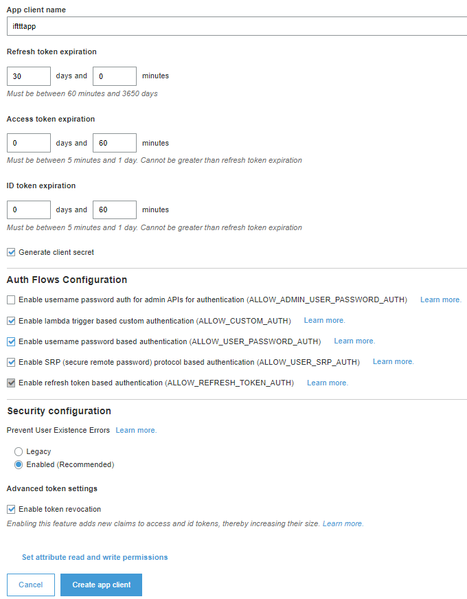
    

9.	Select **App clients settings**.
10.	In App Client setting of "**iftttapp**", tick the "**Cognito User Pool**" check box.
11.	Additionally tick the "Authorization code grant", “Implicit grant”, "email", "openid", and "profile" check boxes.
12.	Enter the IFTTT Service redirect url to the **Callback URL** and  **Sign out URL** . You will get the IFTTT Service redirect url when you create the IFTTT Service in [Chapter 4.4 IFTTT Service Configuration](#chapter4.4)
13.	Click **Save changes**
    

    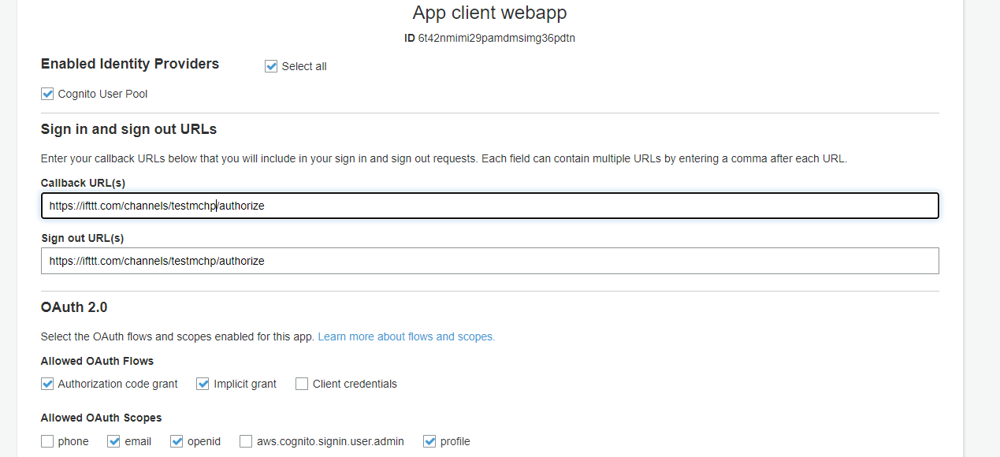
    

---
## 4.2 Create Lambda Function for IFTTT Service 

The Lambda functions here are needed to work with the IFTTT Service.  
&nbsp;
&nbsp; 
  
### 4.2.1 Lambda Function to provide user info for the IFTTT Service 

IFTTT Service send HTTP request to get the endpoint's basic user info after the service authentication process, this lambda is used to provide the info to IFTTT Service.

1.	Go to AWS account Lambda console (https://aws.amazon.com/lambda/)
2.	Click Create Function Button
3.	Select below settings:
    

    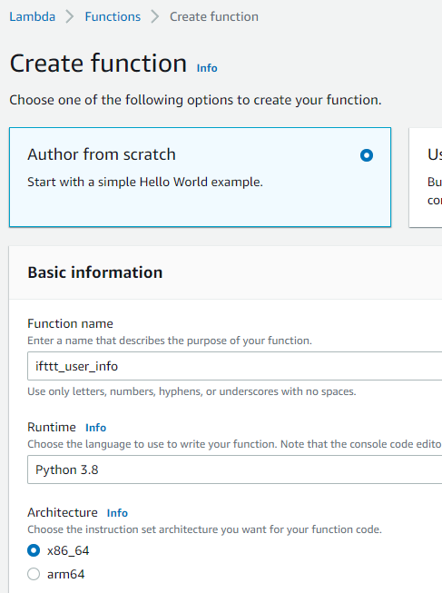
    

4.	Click Create Function Button in the bottom
5.	Go to Tab Configuration, select Environment Variable

    Set variable **USER_POOL_ID**, **USER_POOL_APP_CLIENT_ID**, **USER_POOL_RGION**
    

    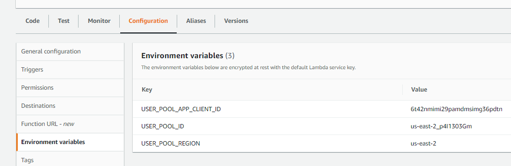
    

    **USER_POOL_ID** is the Cognito User Pool ID. You created User Pool in [Chapter 3.1 Create Congito User Pool And Identity Pool](../03_device_registration_system_setup/README.md
    #chapter3.1)   
    **USER_POOL_APP_CLIENT_ID** is the ID of the Cognito User Pool APP Client “webapp’. You create this APP client in the [Chapter 3.1 Create Congito User Pool And Identity Pool](../03_device_registration_system_setup/README.md#chapter3.1) 
    **USER_POOL_Region** is the Cognito User Pool region.  
    
6.	Go to Tab Code, click Upload from  select .zip file, upload file `ifttt_user_info.zip` loacated in `\04_ifttt_service_setup\resources\software\`

7.	Click Deploy button in the Code source page

### 4.2.2 Lambda Function to provide service status for the IFTTT Service 

This lambda function is used to provide an API endpoint which IFTTT can periodically check for your service’s availability.

1.	Go to AWS account Lambda console (https://aws.amazon.com/lambda/)
2.	Click Create Function Button
3.	Select below settings:
    

    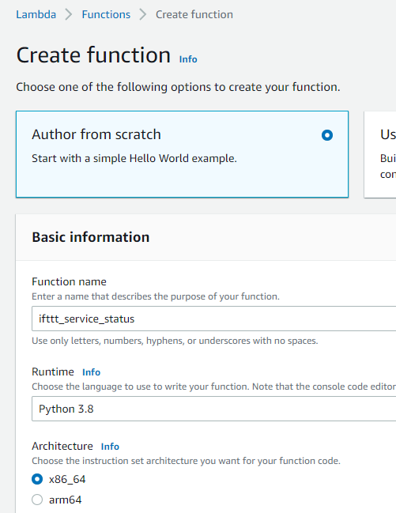
    

4.	Click Create Function Button in the bottom
5.	Go to Tab Configuration, select Environment Variable

    Set variable **IFTTT_SERVICE_KEY**

    

    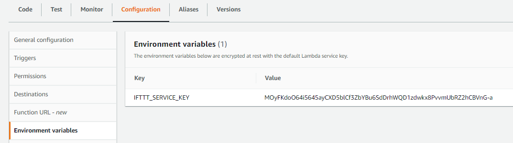
    

    **IFTTT_SERVICE_KEY** is the IFTTT service key. You can find this key when you create the IFTTT Service in [Chapter 4.4 IFTTT Service Configuration](#chapter4.4)

6.	Go to Tab Code, click Upload from  select .zip file, upload file `ifttt_service_status.zip` loacated in `\04_ifttt_service_setup\resources\software\`

7.	Click Deploy button in the Code source page

### 4.2.3 Lambda Function for action (switch on) 

This lambda function is used to provide an API endpoint which IFTTT send the action event to. The action is switching on the LED. 

1.	Go to AWS account Lambda console (https://aws.amazon.com/lambda/)
2.	Click Create Function Button
3.	Select below settings:
    

    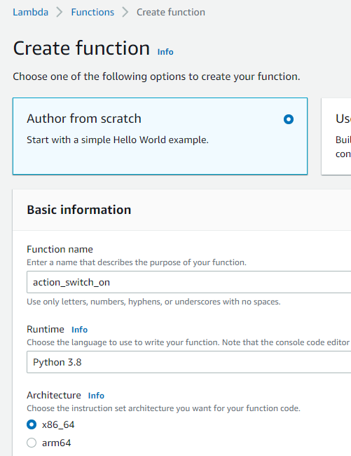
    

4.	Click Create Function Button in the bottom
5.	Go to Tab Configuration, select **Environment Variable**

    Set variable **USER_POOL_ID**, **USER_POOL_APP_CLIENT_ID**, **USER_POOL_RGION**
    

    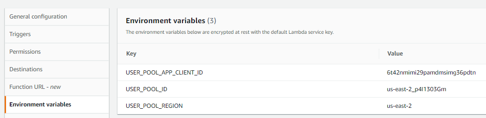
    

    l
    **USER_POOL_ID** is the Cognito User Pool ID. You created User Pool in [Chapter 3.1 Create Congito User Pool And Identity Pool](../03_device_registration_system_setup/README.md#chapter3.1) 
    **USER_POOL_APP_CLIENT_ID** is the ID of the Cognito User Pool APP Client “webapp’. You create this APP client in [Chapter 3.1 Create Congito User Pool And Identity Pool](../03_device_registration_system_setup/README.md#chapter3.1) 
    **USER_POOL_Region** is the Cognito User Pool region.  

6.	Go to Tab Configuration, select **Permission**, click the execution role name
    

    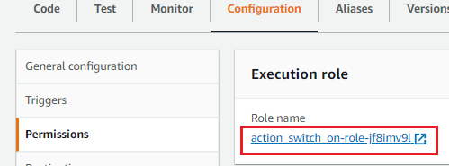
    

7.  Add "AWSIoTDataAccess" Policy to the role
    

    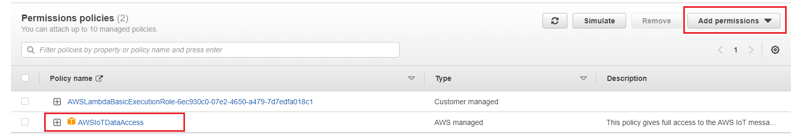
    

8. In the Lambda setting, go to Tab Code, click **Upload from**, then **select .zip file**, upload file `action_switch_on.zip` loacated in `\04_ifttt_service_setup\resources\software\`

9.	Click Deploy button in the Code source page

### 4.2.4 Lambda Function for action (switch off) 

This lambda function is used to provide an API endpoint which IFTTT send the action event to. The action is switching on the LED. 

1.	Go to AWS account Lambda console (https://aws.amazon.com/lambda/)
2.	Click Create Function Button
3.	Select below settings:
    

    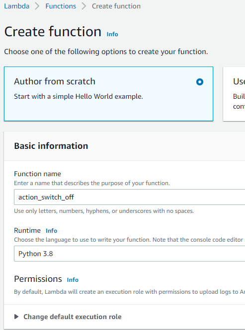
    

4.	Click Create Function Button in the bottom
5.	Go to Tab Configuration, select **Environment Variable**

    Set variable **USER_POOL_ID**, **USER_POOL_APP_CLIENT_ID**, **USER_POOL_RGION**
    

    
    

    
    **USER_POOL_ID** is the Cognito User Pool ID. You created User Pool in [Chapter 3.1 Create Congito User Pool And Identity Pool](../03_device_registration_system_setup/README.md#chapter3.1)   
    **USER_POOL_APP_CLIENT_ID** is the ID of the Cognito User Pool APP Client “webapp’. You create this APP client in [Chapter 3.1 Create Congito User Pool And Identity Pool](../03_device_registration_system_setup/README.md#chapter3.1)   
    **USER_POOL_Region** is the Cognito User Pool region.  

6.	Go to Tab Configuration, select **Permission**, click the execution role name
    

    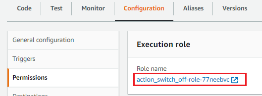
    

7.  Add "AWSIoTDataAccess" Policy to the role
    

    
    

8. In the Lambda setting, go to Tab Code, click **Upload from**, then **select .zip file**, upload file `action_switch_off.zip` loacated in `\04_ifttt_service_setup\resources\software\`

9.	Click Deploy button in the Code source page

### 4.2.5 Lambda Function for action device option 

This lambda function is used to provide an API endpoint which IFTTT request the list of options for the action. The list of options in this project is the device friendly name that you register in the device registration website

1.	Go to AWS account Lambda console (https://aws.amazon.com/lambda/)
2.	Click Create Function Button
3.	Select below settings:
    

    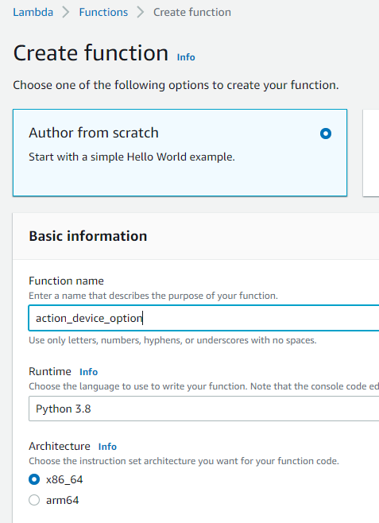
    

4.	Click Create Function Button in the bottom
5.	Go to Tab Configuration, select Environment Variable

    Set variable **USER_POOL_ID**, **USER_POOL_APP_CLIENT_ID**, **USER_POOL_RGION**, **DB_INSTANCE**, **DB_NAME**, **DB_USER_NAME** and **DB_PASSWORD** 
    

    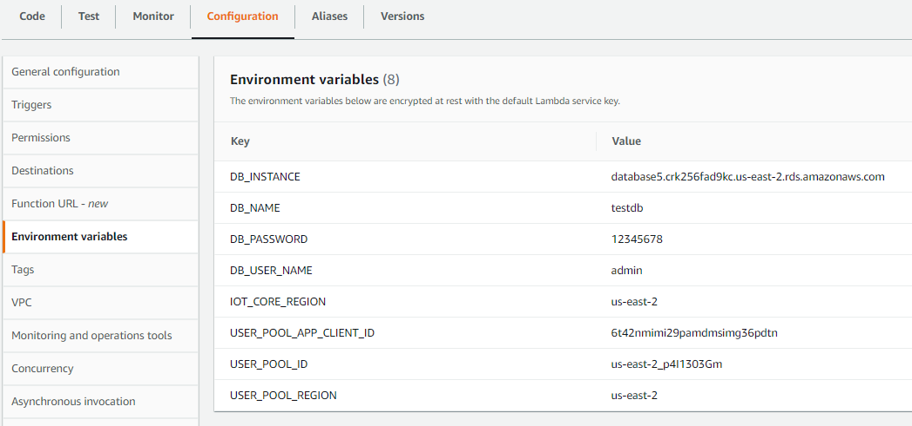
    

    
    **USER_POOL_ID** is the Cognito User Pool ID. You created User Pool in [Chapter 3.1 Create Congito User Pool And Identity Pool](../03_device_registration_system_setup/README.md#chapter3.1)   
    **USER_POOL_APP_CLIENT_ID** is the ID of the Cognito User Pool APP Client “webapp’. You create this APP client in [Chapter 3.1 Create Congito User Pool And Identity Pool](../03_device_registration_system_setup/README.md#chapter3.1)    
    **USER_POOL_Region** is the Cognito User Pool region.  
    **DB_INSTANCE** is the RDS database instance name; **DB_NAME** is the RDS database name;  **DB_USER_NAME** and **DB_ PASSWORD** are the user name and password of the  RDS database. you set these values when you create the database at [Chapter 3.2 Create RDS For Storing Registration Data](../03_device_registration_system_setup/README.md#chapter3.2)  

6.  Go to Tab Configuration, select **Permission**, click the execution role name
    

    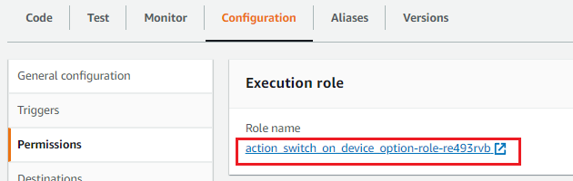
    

7.  Add "lambda_access_vpc_policy" Policy to the role
    

    
    

6. Go to Tab Configuration, select VPC, edit the VPC be the default VPC, Subnets be the region b subnet (private subnet we defined in section Create NAT Gateway And Route table), and Security groups be the default one.
    

    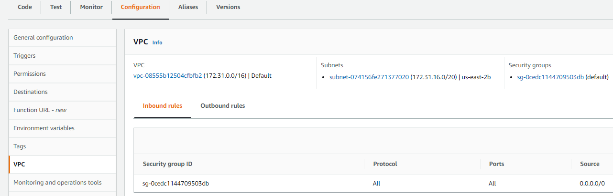
    

7.	Go to Tab Code, click **Upload from**, then **select .zip file**, upload file `action_device_option.zip` loacated in `\04_ifttt_service_setup\resources\software\`

8. Modify the **keys** variable defined in the function **validateToken()** in lambda_function.py  
    The keys is JSON Web Key Set (JWKS) of your Congito user pool which is used to decode the JWT token from the user pool. You can get your JWKS at  
    > "https://cognito-idp.{region}.amazonaws.com/{cognito_userPoolId}/.well-known/jwks.json"  
    
    **Example**: https://cognito-idp.us-east-2.amazonaws.com/us-east-2_p4I1303Gm/.well-known/jwks.json

9.	Click Deploy button in the Code source page

---
## 4.3 Create API Gateway 

You need to use Amazon API Gateway Service to create HTTP API to work with the IFTTT Service for the authenization and device action. IFTTT Service call these API to contol the device endpoint.  

Below table show the routes of the API you need to create.

| **Method** | **Resource Path**         | **Integrations**                                | **Usage**                      |
|------------|---------------------------|-------------------------------------------------|--------------------------------|
| GET        | /ifttt/v1/user/info        | Lambda function: ifttt_user_info | request the device endpoint information and verify if the user’s access token is still valid         |
| GET        | /ifttt/v1/status           | Lambda function: ifttt_service_status    | Check the service's availability |
| POST       | /ifttt/v1/actions/switch_on    | Lambda function: action_switch_on    | Send the action event to the device endpoint            |
| POST       | /ifttt/v1/actions/switch_on/fields/device/options    | Lambda function: action_device_option    | Request to fetch the list of device options          |
| POST       | /ifttt/v1/actions/switch_off    | Lambda function: action_switch_off    | Send the action event to the device endpoint            |
| POST       | /ifttt/v1/actions/switch_off/fields/device/options    | Lambda function: action_device_option    | Request to fetch the list of device options          |

&nbsp;
&nbsp; 
Steps:
1.	Go to  Amazon API Gateway console
2.	In the navigation pane, choose APIs.
3.	Click Create API
4.	Choose HTTP API, click Build
5.	Set a name for the API
6.	Click Add integration to add the integrations. The integrations are the backend services that the API will communicate with. According to the above table, we have 4 integrations needed to be added. All these integrations are Lambda function. Below picture show the added integrations. 
    

    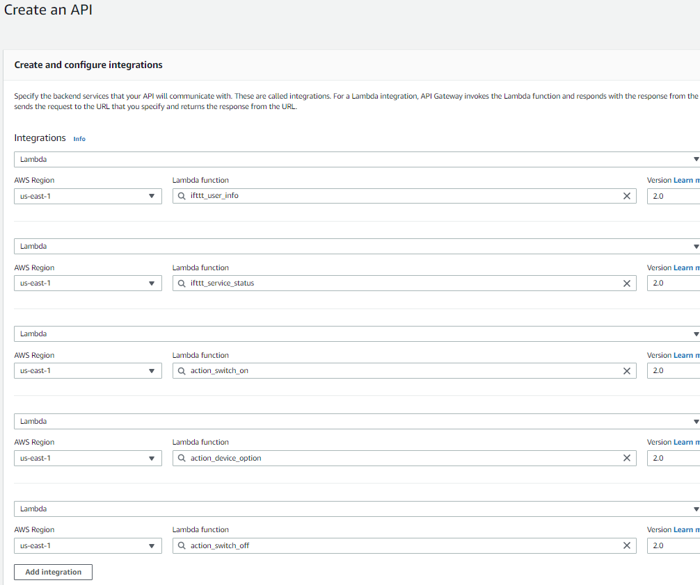
    

7.	Click Next
8.	Configure the routes as below picture, click Next
    

    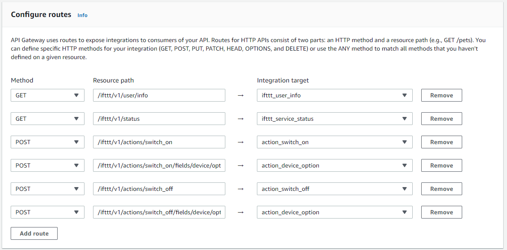
    

9.	Keep the Stage name as $default, click Next
10.	Click Create
11.	After you create the API, you can find the Invoke URL of this API in the details of the API. Copy this URL as this URL is needed in the IFTTT Service Configution in [Chapter 4.4 IFTTT Service Configuration, step 6](#chapter4.4)
    

    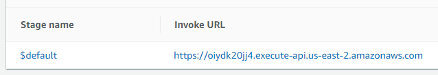
    

---
## 4.4 IFTTT Service Configuration 

To configure the IFTTT Service, you can go to IFTTT website and follow below steps

Setup steps:
1.	Go to IFTTT website https://ifttt.com/explore
2.	Click **Developer** in the top menu bar and select **Dashboard**
    

    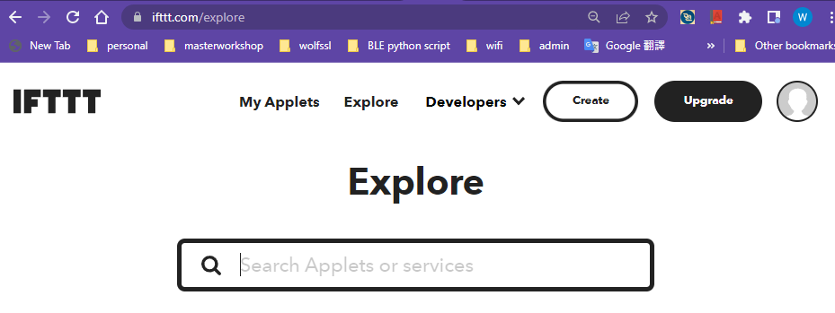
    

3.  Click **Add services**
4.  Input the service name and other item like below picture, click **Create**
    

    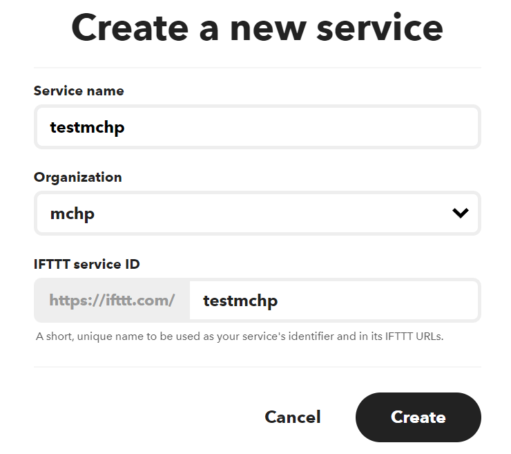
    

5.  After the service is created, go to Tab ** Service**, select **General**, input the information
    

    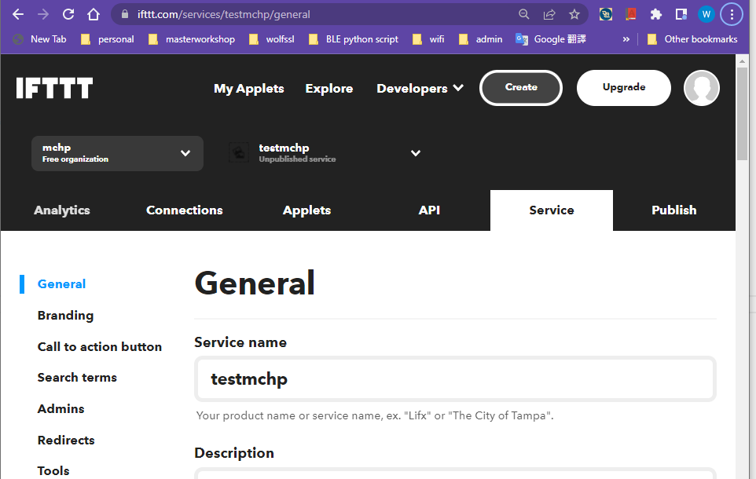
    

6.  Go to Tab **API**, select **General**, input the IFTTT API URL with the URL of the HTTP API that you create in AWS API Gateway in [Chapter 4.3 Create API Gateway, step 11](#chapter4.3)   
    Copy the service key to notepad for the setting in other chapters.
    Click **Save**
    

    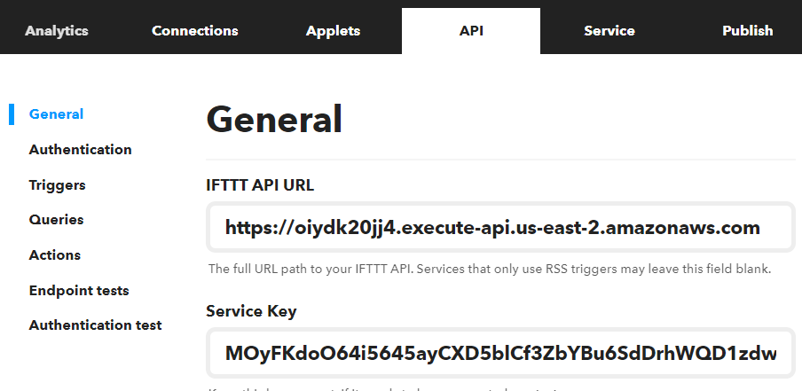
    

7.  Go to Tab **API**, select **Authentication**, this is the setting for IFTTT Service to authenticate with your Cognito user pool to get the authorization to access the HTTP API.  
    Below is the setttings you need to configure:
    - select "My API has users with expiring OAuth2 access tokens and uses refresh tokens"
    - **Client ID**: Cognito iftttapp App client ID  (Refer to [Chapter 4.1 Create Cognito User Pool Client](#chapter4.1))
    - **Client secret**: Cognito iftttapp App client Secret (Refer to [Chapter 4.1 Create Cognito User Pool Client](#chapter4.1))
    - **Authorization URL**: https://<Domain_Name_Of_Cognito_User_Pool>/login?scope=profile (Domain name is refer to [Chapter 3.1 Create Cognito User Pool And Identity Pool, step14](../03_device_registration_system_setup/README.md#chapter3.1))
    - **Token URL**: https://<Domain_Name_Of_Cognito_User_Pool>/token
    - **Demo account login**: A user name of the Cognito User Pool  (You can create a user in the Cognito user pool in the AWS Cognito console )
    - **Demo account password**: The password of the user

    Click **Save** 

8.  Go to Tab **API**, select **Action**, click **New action** to create "switch_on" action
    Below is the setttings you need to configure:
    - **Name**: switch_on
    - **Description**: test
    - **Endpoint**: switch_on  
    Under **Action fields**
        - **Label**: device
        - **Key name**: device
        - **Required**: Select option "This action field is required for Applets to work"
        - **Action field type**: select option"Dropdown list" 
        - **Data source for dropdown list**: select option "Retrieve list items from my service"

    Click **Save** 

8.  Go to Tab **API**, select **Action**, click **New action** to create "switch_off" action
    Below is the setttings you need to configure:
    - **Name**: switch_off
    - **Description**: test
    - **Endpoint**: switch_off  
    Under **Action fields**
        - **Label**: device
        - **Key name**: device
        - **Required**: Select option "This action field is required for Applets to work"
        - **Action field type**: select option"Dropdown list" 
        - **Data source for dropdown list**: select option "Retrieve list items from my service"

    Click **Save** 
