# 5. Run Demo

[Back to Main page](../README.md)

## Contents

1. [Register devices](#chapter5.1)
1. [Create IFTTT Applet](#chapter5.2)
1. [erform Tests](#chapter5.3)

**Watch the video and see how to setup and perform the demo**

<a href="https://youtu.be/zP6CPep3yNY" target="_blank">
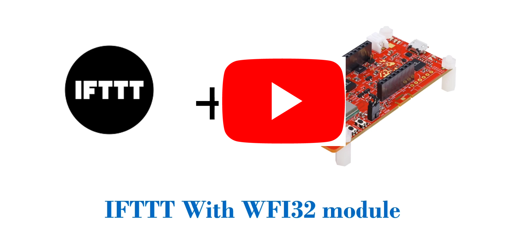</a>

## 5.1 Register devices

1. Go to the device registration webpage that you create in [Chapter 3.5 Create Registration website](../03_device_registration_system_setup/README.md#chapter3.5)
    

    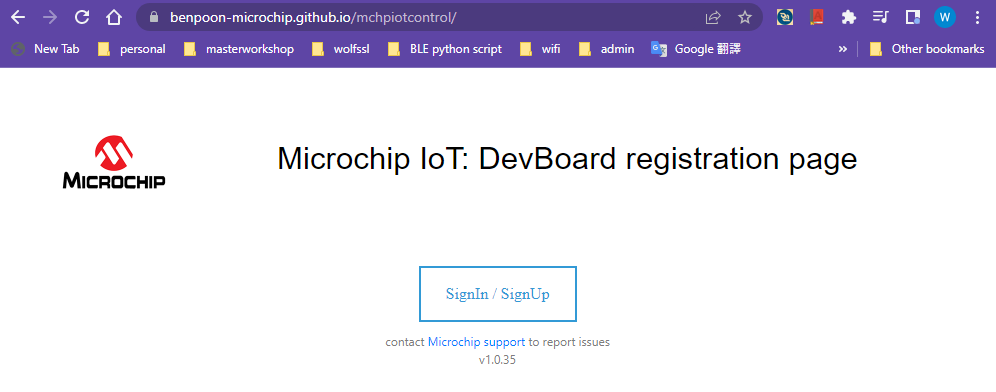
    

2. Sign-in to the webpage, if you did not have account, you can sign-up an acount first
3. Input the device thing name in the righ panel and click **Register**, the registered deivce shown on the left panel.  
   You can get the device thing name when you perform the steps in [Chapter 2 Connect WFI32-IoT / PIC32MZW1 Curiosity Board to AWS Cloud](../02_connect_wfi32_to_cloud/README.md#top)
    

    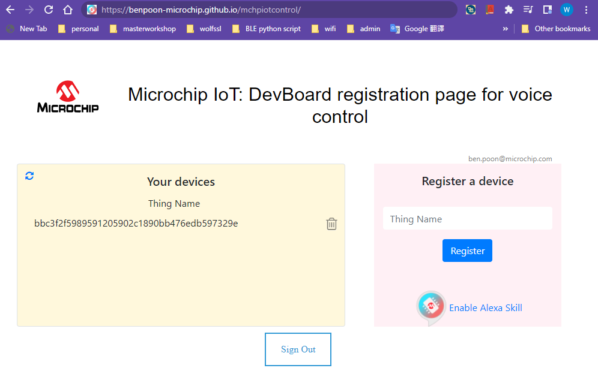
    

---
## 5.2 Create IFTTT Applet

You will create 2 Applets to switch on and off the LED on the WFI32-IoT board or WFI32E Curiosity board 

1. Go to IFTTT webpage ([link](https://ifttt.com))
2. Click **Create** button in the upper right corner
    

    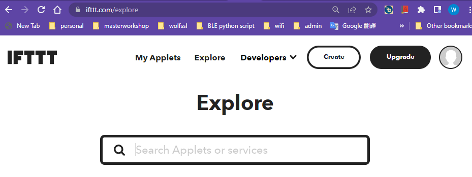
    

3. Click **If  This** button to select the IFTTT trigger service
    

    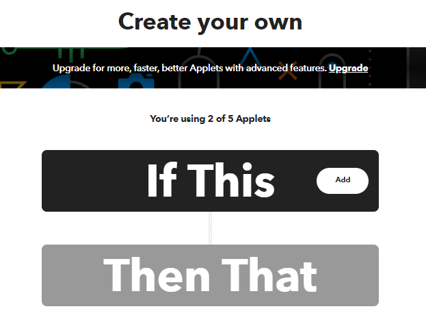
    

4. Select **Google Assistant**
5. Select **Say a simple phrase**
    

    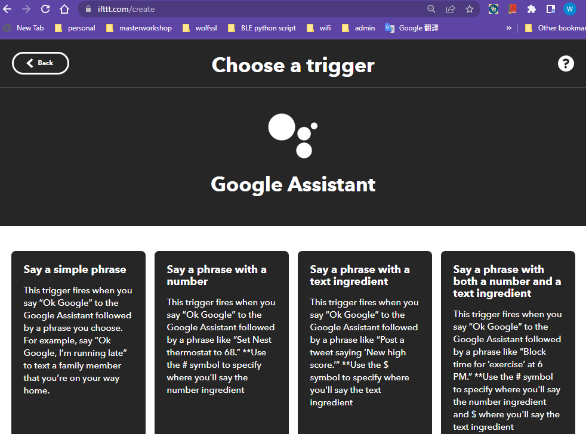
    

6. Click "Connect" to connect the service and login with the Google account
7. Input below information in the trigger setting
    

    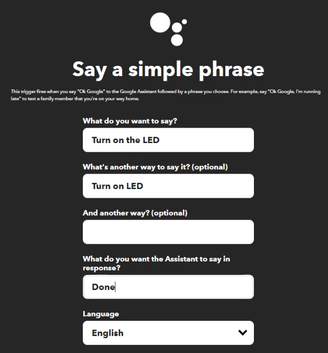
    

8. Click **Then That** to select the IFTTT action service
    

    
    

9. Select **testmchp** service, you created this service in [Chapter 4.4 IFTTT Service Configuration](../04_ifttt_service_setup/README.md#chapter4.4)
10. Select **switch_on** action
    

    
    

11. Click "Connect" to connect the service and login with the account that you created in the device registration webpage
12. Select the device thing id you want to control, click **Create action**
    

    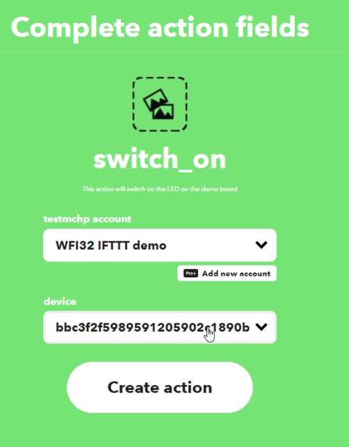
    

13. Click **Continue** and **Finish**. Now you created an applet to switch on the LED on the board.
14. Next, you can repeate step 2 - 13 to create another applet to switch off the LED.  
    Input below information in the trigger setting
    

    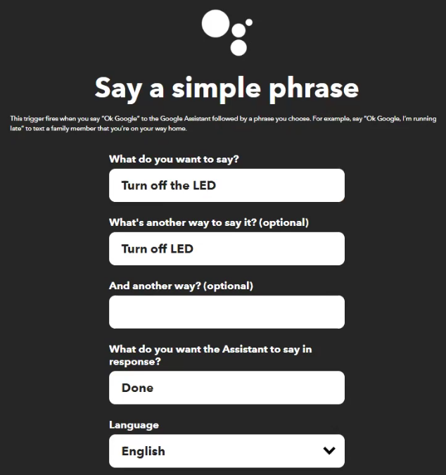
    

    Select the **switch_off** action in **testmchp** service
    

    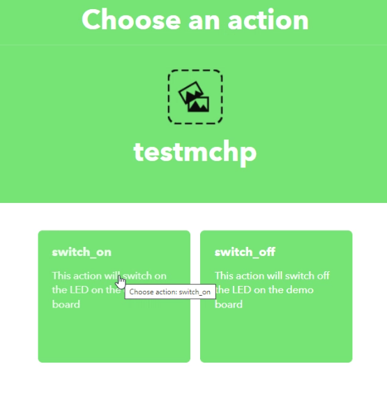
    

15. At the end, you create 2 applets to switch on and off the LED on the demo board
    

    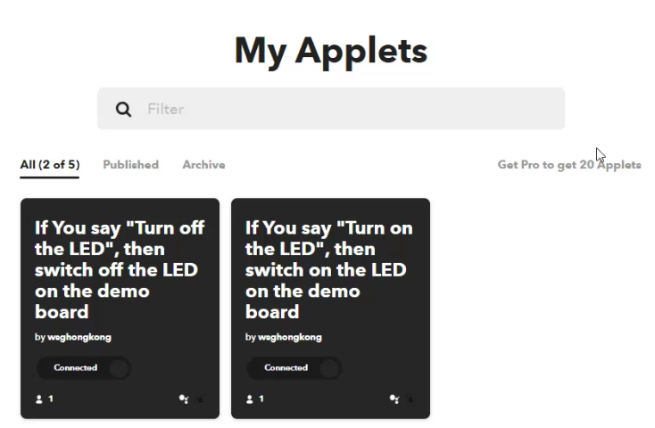
    

---
## 5.3 Perform Tests

1. Power on the WFI32-IoT board/ WFI32E Cusiotiy board by connecting the board to the PC
2. Follow [Chapter 2 Connect WFI32-IoT / PIC32MZW1 Curiosity Board to AWS Cloud](../02_connect_wfi32_to_cloud/README.md#top), the board can connect to the target AP and the AWS Cloud, you can capture the application log for checking.
3. Install the Google Assistant IOS/Android APP to your smartphone. Login the APP with your google account.
4. Speak "OK google, turn on the LED" or "OK google, turn off the LED" to the smartphone APP.
5. The board receive the command and print application log "LED ON" or "LED OFF".  
    For WFI32-IoT board, the Yellow LED will remain on/off for 2 seconds when it receive the command.  
    For WFI32E Curiosity board, the onboard Green LED will turn on/off when it receive the command.
    

    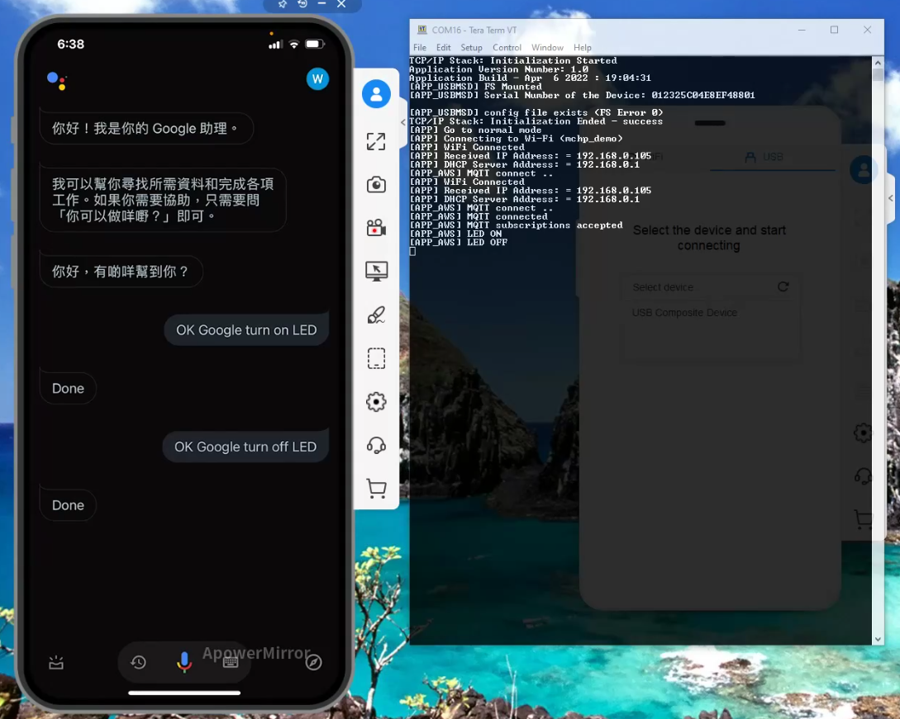
    
