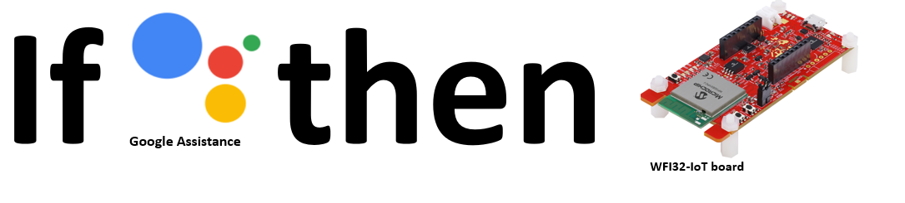

# PIC32MZW1_WFI32_IFTTT_Action_Example

Devices: **| PIC32 WFI32E | WFI32 | Trust\&Go (ECC608) |**  
Features: **| IFTTT | Secure Cloud Connectivity | Voice Control |**

## Introduction
[IFTTT](https://ifttt.com/explore/new_to_ifttt) is short for "If This Then That", which is a way to integrate different apps, devices, and services to work togehter.  	
This project is the extend of the [WFI32-IOT OOB project](https://github.com/MicrochipTech/WFI32-IoT) and [PIC32W1 Curisoity OOB project](https://github.com/MicrochipTech/PIC32MZW1_Curiosity_OOB) to make the board can be controlled through IFTTT platform.  
This repository contains the guide and materials to set up an IFTTT action service to control WFI32-Iot Board or PIC32MZW1 Curiosity board. To do this, the WFI32-Iot Board or PIC32MZW1 Curiosity board need to connect to AWS Cloud. IFTTT Service send the action event to the endpoint device (WFI32-Iot Board or PIC32MZW1 Curiosity board) through the AWS Cloud. This guide show you how to create the IFTTT Service and IFTTT Applet, and how to configure the AWS Cloud to let IFTTT Service work with the cloud and control the WFI32-Iot Board or PIC32MZW1 Curiosity board.

Below video show a simply demo that using Google Assistance as the trigger, and the action is controlling WFI32 demo board's LED on/off. User can speak to Google Assistance to control the LED on/ off on the board. The trigger acutally can be a lot of differnet available service on the IFTTT platform like Alexa, Siri, Date and Time Service, IoT devices like Wemo light switch etc.	

Below are other some examples of using IFTTT trigger to control the board:
1. Use "Date and Time" Service to set the date and time to turn on/off the LED on the WFI32 demo board
2. Use "Location" Service, turn on/off the board's LED on the demo board when you arrive home
3. Use "Honeywell Home" Service, turn on/off the board's LED when the Honeywell camera detect motion
4. Use "Siri" Serivce, User can speak to Siri to control the on/off of the board's LED  
5. Use "WeMo Humidifier" Serivce, Turn on/off of the board's LED when the humidifier detect the humidity level rises above threshold 

>**Note:** There is another IFTTT Demo in the Microchip Harmony framework. This project show about using WFI32-Iot Board or PIC32MZW1 Curiosity board to act as IFTTT trigger. User press a button on the board can trigger to send a message to the email through IFTTT service. You can visit [this link](https://github.com/Microchip-MPLAB-Harmony/wireless_apps_pic32mzw1_wfi32e01/tree/master/apps/ifttt) if you have interest.

## Resources

<!--- [PIC32MZ W1 Family Landing page](https://www.microchip.com/PIC32MZW1)-->
- [WFI32E01 Module Product page, Datasheet, Software User Guide, Family Reference Manual](http://www.microchip.com/wwwproducts/en/WFI32E01PC)
- [WFI32-IoT Board](https://www.microchip.com/en-us/development-tool/ev36w50a)
- [PIC32WFI32E Curiosity Board](http://www.microchip.com/EV12F11A)
- [WFI32-IOT OOB project](https://github.com/MicrochipTech/WFI32-IoT)
- [PIC32W1 Curisoity OOB project](https://github.com/MicrochipTech/PIC32MZW1_Curiosity_OOB)

## Table of Contents

1. [Overview](01_overview/README.md#top)
	1. 	[Overview Of The Solution](01_overview/README.md#chapter1.1)
		1.	[IFTTT Service Workflow](01_overview/README.md#chapter1.1.1)
		2.	[Device Registration System](01_overview/README.md#chapter1.1.2)
2. [Connect WFI32-IoT / PIC32MZW1 Curiosity Board to AWS Cloud](02_connect_wfi32_to_cloud/README.md#top)
	1.	[Connecting the Board to the Host PC](02_connect_wfi32_to_cloud/README.md#chapter2.1)
	2.	[Connecting the Board to Wi-Fi Networks](02_connect_wfi32_to_cloud/README.md#chapter2.2)
3. [Device Registration System Setup](03_device_registration_system_setup/README.md#top)
	1.	[Create Cognito User Pool And Identity Pool](03_device_registration_system_setup/README.md#chapter3.1)
	1. 	[Create RDS For Storing Registration Data](03_device_registration_system_setup/README.md#chapter3.2)
	1. 	[Create Lambda Function for Device Registration ](03_device_registration_system_setup/README.md#chapter3.3)
		1.	[Lambda Function for registering devices](03_device_registration_system_setup/README.md#chapter3.3.1)
    	1.  [Lambda Function for getting user devices](03_device_registration_system_setup/README.md#chapter3.3.2)
    	1.  [Lambda Function for deleting user devices](03_device_registration_system_setup/README.md#chapter3.3.3)
	1. 	[Create API Gateway](03_device_registration_system_setup/README.md#chapter3.4)
	1. 	[Create Registration website](03_device_registration_system_setup/README.md#chapter3.5)
4. [IFTTT Service Related Setup](04_ifttt_service_setup/README.md#top)
	1.  [Create Cognito User Pool Client](04_ifttt_service_setup/README.md#chapter4.1)
	1.  [Create Lambda Function for IFTTT Service ](04_ifttt_service_setup/README.md#chapter4.2)
		1.  [Lambda Function to provide user info for the IFTTT Service](04_ifttt_service_setup/README.md#chapter4.2.1)
		1.  [Lambda Function to provide service status for the IFTTT Service](04_ifttt_service_setup/README.md#chapter4.2.2)
		1.  [Lambda Function for action (switch on)](04_ifttt_service_setup/README.md#chapter4.2.3)
		1.  [Lambda Function for action (switch off)](04_ifttt_service_setup/README.md#chapter4.2.4)
		1.  [Lambda Function for action device option](04_ifttt_service_setup/README.md#chapter4.2.5)
	1.  [Create API Gateway](04_ifttt_service_setup/README.md#chapter4.3)
	1.  [IFTTT Service Configuration](04_ifttt_service_setup/README.md#chapter4.4)
5. [Run Demo](05_run_demo/README.md#top)
	1. 	[Register devices](05_run_demo/README.md#chapter5.1)
	1. 	[Create IFTTT Applet](05_run_demo/README.md#chapter5.2)
	1. 	[erform Tests](05_run_demo/README.md#chapter5.3)

